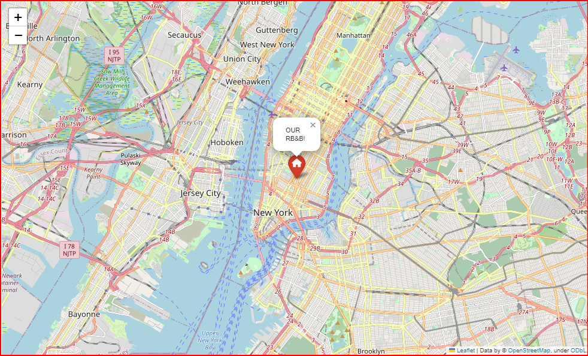

# AIRBNB-ANALYSIS

# AIRBNB ANALYSIS

In this project a NYC AIRBNB dataset is analyzed in order to answer following questions:

## QUESTIONS
1- Top 3 neighbourhood with highest number of entire home/aprt renting , top 3 for Private room renting and Top 3 for shared room

2- Neighbourhood with more available bedrooms, does this data affect the average renting price of the neighbourhood?

3- Does the total number of amenities affect the final price?

4- Which is the percentaje of rentals offering each listed amenity?

5- Perfect renting: to get the top price determine:

    - Neighbourhood

    - room_type

    - Number of amenities  

    - Need to be a superhost of verified host?

A detail explanation as well as code used to answer each question is abailavable in [here](Test3-Airbn_analysis.ipynb)

## ANSWERS:
As a result of the analysis of the dataset following answeres were obtained:

**1- Top 3 neighbourhoodd for each room_type:**

a) entire_home

b)  private_room

c) shared_room

  

**2-Neighbourhood with the Most Available Bedrooms: Does this Data Impact the Average Renting Price of the Neighbourhood?**

The neighbourhood with the highest number of available bedrooms is Brooklyn. However, there appears to be no significant impact on prices, as illustrated in the following plot::

 

**3- Does the total number of amenities affect the final price?**

As is often the case with any analysis, the final price is influenced by numerous factors. Therefore, a plot featuring only one variable is inevitably affected by other variables. Keeping this in mind, the plot below reveals that, for the number of amenities ranging approximately between 5 and 35, there is a discernible correlation between the number of amenities and the price. Beyond or below this range, it appears that the influence of other factors hinders our ability to observe whether a correlation exists or not.

**4- Which is the percentaje of rentals offering each listed amenity?**

 The following table shows the top 15 most frequent amenities offered:

**5- Perfect renting based on the following parameters: Neighbourhood, room_type, number of amenities, being or not a superhos or a verified host**

The perfect renting: to get the top price:

    - Neighbourhood = NOHO

    - room_type = ENTIRE HOUSE/APT

    - Number of amenities  = 35

    - Need to be a superhost of verified host = NO, NEITHER A SUPERHOST NOR A VERIFIED HOST

    and here is the map of the center of all available rooms/apt in Noho neighbourhood:

